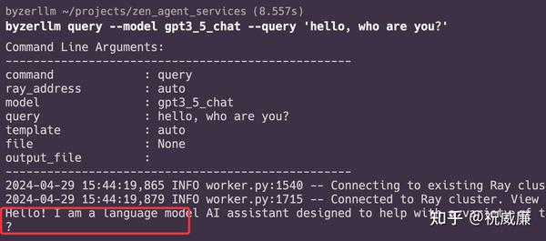

# 一个努力成为大模型编程接口的神奇Python库

## 前言（努力勾起你的好奇心）

如果有这么一个Python库：

1. 可以用一致的方式部署开源大模型，SaaS模型，比如用一个 deploy 命令就搞定
2. 支持大语言模型，多模态模型，图生文，文生图，语音合成啥的一个都不少。
3. 提供了一致的Python API, 可以秒换任何大模型
4. 提供过了兼容 OpenAI 的接口，用 一条 serve 命令搞定。
5. 还支持预训练，微调大模型
6. 还能支持分布式部署和管理，生产So easy.
7. 支持GPU，CPU或者混合部署
8. 支持 Ollama 的代理。
9. 自带向量/全文检索数据库

有这些够了么？ No,!No,!No! 它的使命是让我们更好的使用大模型，你是不是被prompt 管理搞到焦头烂额？他提供了 prompt 函数和类，让你和代码一样使用文本。你是不是苦于 Function Calling 不是所有模型都能支持？ 这个神奇的 Python 库还提供不依赖于底层模型的相关实现，总之给你提供一切让你觉得特别曼妙的编程接口。

这个神奇的库就是 [byzerllm](https://github.com/allwefantasy/byzer-llm)， 她也是 [AutoCoder](https://github.com/allwefantasy/auto-coder) 默认的模型编程接口。

## 安装

一条命令搞定：

```bash
pip install -U auto-coder
ray start --head
```

安装 auto-coder 会自动安装 byzerllm以及一些依赖库。

第二条命令是启动一个 server 进程，接受后续诸如 deploy 模型等指令。

如果你使用

```bash
pip install -U byzer-llm
```

则需要自己安装依赖，比较麻烦，我们还是选择第一个吧。

## 让我们开始玩耍吧

比如你手头有个 kimi, openai 或者 deepseek 等任意 SaaS 模型的Token，我们就可以部署他们：

```bash
byzerllm deploy --pretrained_model_type saas/openai \
--cpus_per_worker 0.001 \
--gpus_per_worker 0 \
--num_workers 3 \
--infer_params  saas.api_key=${MODEL_OPENAI_TOKEN} saas.model=gpt-3.5-turbo-0125 \
--model gpt3_5_chat
```

这样就部署了一个 Kimi 模型的代理。其他参数主要是一些资源配置，因为是SaaS模型，我们不许哟啊GPU,仅需少量CPU即可。

你马上就可以通过命令行验证下：

```bash
byzerllm query --model gpt3_5_chat --query 'hello, who are you?'
```



如果是部署一个开源大模型，一毛一样的部署方法：

```bash
byzerllm deploy --pretrained_model_type custom/auto \
--infer_backend vllm \
--model_path /home/winubuntu/models/openbuddy-zephyr-7b-v14.1 \
--cpus_per_worker 0.001 \
--gpus_per_worker 1 \
--num_workers 1 \
--infer_params backend.max_model_len=28000 \
--model zephyr_7b_chat
```

这里我指定了用一块 GPU 部署，模型最大token长度为 28000。

你可以通过 `byzerllm stat` 来查看当前部署的模型的状态。

```bash
byzerllm stat --model gpt3_5_chat
```

输出：
```
Command Line Arguments:
--------------------------------------------------
command             : stat
ray_address         : auto
model               : gpt3_5_chat
file                : None
--------------------------------------------------
2024-05-06 14:48:17,206	INFO worker.py:1564 -- Connecting to existing Ray cluster at address: 127.0.0.1:6379...
2024-05-06 14:48:17,222	INFO worker.py:1740 -- Connected to Ray cluster. View the dashboard at 127.0.0.1:8265
{
    "total_workers": 3,
    "busy_workers": 0,
    "idle_workers": 3,
    "load_balance_strategy": "lru",
    "total_requests": [
        33,
        33,
        32
    ],
    "state": [
        1,
        1,
        1
    ],
    "worker_max_concurrency": 1,
    "workers_last_work_time": [
        "631.7133535240428s",
        "631.7022202090011s",
        "637.2349605050404s"
    ]
}
```
解释下上面的输出：

1. total_workers: 模型gpt3_5_chat的实际部署的worker实例数量
2. busy_workers: 正在忙碌的worker实例数量
3. idle_workers: 当前空闲的worker实例数量
4. load_balance_strategy: 目前实例之间的负载均衡策略
5. total_requests: 每个worker实例的累计的请求数量
6. worker_max_concurrency: 每个worker实例的最大并发数
7. state: 每个worker实例当前空闲的并发数（正在运行的并发=worker_max_concurrency-当前state的值）
8. workers_last_work_time: 每个worker实例最后一次被调用的截止到现在的时间


至于使用方式，只要使用 byzerllm 部署的，就都可以用相同的方式使用。

我们来看看怎么在 Python中使用：

```python
import byzerllm

byzerllm.connect_cluster()

@byzerllm.prompt(llm="gpt3_5_chat")
def hello_llm(name:str)->str:
    '''
    你好，我是{{ name }}，你是谁？
    '''

hello_llm("byzerllm")
```

下面是输出：


是不是很神奇？这就是 prompt 函数。如果你想知道发送给大模型的完整Prompt是啥？你可以这么用：

```python
hello_llm.prompt("byzerllm")
```


你也可以换个模型去支持 hello_llm 函数：

```python
hello_llm.with_llm("新模型").prompt("byzerllm")
```

当然了，我们还可以通过 chat_oai 等传统方式和大模型沟通，限于篇幅就不举例子了，后面会有所提及。

如果你希望对接第三方的比如 Jan, NextChat 等聊天界面，你可以这样：

```bash
byzerllm serve --port 80000
```

就可以启动一个 OpenAI 兼容的服务，然后你配置下这些聊天界面后面的端口就可以直接用了。


如果你喜欢用 Ollama, 也没问题，我们可以把他当做一个SaaS服务来用，比如这样来部署：

```bash
byzerllm deploy  --pretrained_model_type saas/openai \
--cpus_per_worker 0.01 \
--gpus_per_worker 0 \
--num_workers 2 \
--infer_params saas.api_key=xxxx saas.model=llama3:70b-instruct-q4_0  saas.base_url="http://192.168.3.106:11434/v1/" \
--model ollama_llama3_chat
```

这样就可以像前面一样用 Ollama 部署的模型了。

前面我们说，如何支持各种模型的 function calling呢？来看一个示例：

```python
t = llm.chat_oai([{
    "content":'''计算当前时间''',
    "role":"user"    
}],tools=[compute_date_range,compute_now],execute_tool=True)

t[0].values
```
我们只要把函数当 tools 传入就可以啦，基本大部分30B以上的模型都支持这个功能。

还可以让大模型返回 Python对象：

```python
import pydantic 

class Story(pydantic.BaseModel):
    '''
    故事
    '''

    title: str = pydantic.Field(description="故事的标题")
    body: str = pydantic.Field(description="故事主体")


t = llm.chat_oai([
{
    "content":f'''请给我讲个故事，分成两个部分，一个标题，一个故事主体''',
    "role":"user"
},
],response_class=Story)

t[0].value

## output: Story(title='勇敢的小兔子
```

只要指定下 response_class 即可，是不是很方便？

## 内置的向量/全文检索库

如果你想要一个向量+全文检索的数据库，可以这样：

```bash
byzerllm storage start
```

它会自动下载和安装。然后你就可以配合 auto-coder 来构建一个本地知识库了，一条命令解决战斗：

```bash
auto-coder doc build --source_dir /Users/allwefantasy/projects/doc_repo \
--model gpt3_5_chat \
--emb_model gpt_emb 
```

现在你就可以查询你的私人知识库了：

```bash
auto-coder doc query --model gpt3_5_chat \
--emb_model gpt_emb \
--query "如何通过 byzerllm 部署 gpt 的向量模型，模型名字叫 gpt_emb "
```

输出：

```
=============RESPONSE==================


2024-04-29 16:09:00.048 | INFO     | autocoder.utils.llm_client_interceptors:token_counter_interceptor:16 - Input tokens count: 0, Generated tokens count: 0
通过 byzerllm 部署 gpt 的向量模型，模型名字叫 gpt_emb，需要使用以下命令：


byzerllm deploy --pretrained_model_type saas/openai \
--cpus_per_worker 0.001 \
--gpus_per_worker 0 \
--num_workers 1 \
--infer_params saas.api_key=${MODEL_OPENAI_TOKEN} saas.model=text-embedding-3-small \
--model gpt_emb


=============CONTEXTS==================
/Users/allwefantasy/projects/doc_repo/deploy_models/run.txt
```

另外，byzerllm storage 也是支持多worker 分布式部署的哦。

## 总结
这篇文章简单介绍了下 Python 库 byzerllm, 用它可以轻松管理任意大模型，并且自带的存储可以让用户完成很多有意思的事情，最后，byzerllm 还提供了非常强大的编程接口，让你使用大模型就和平时普通编程一样。